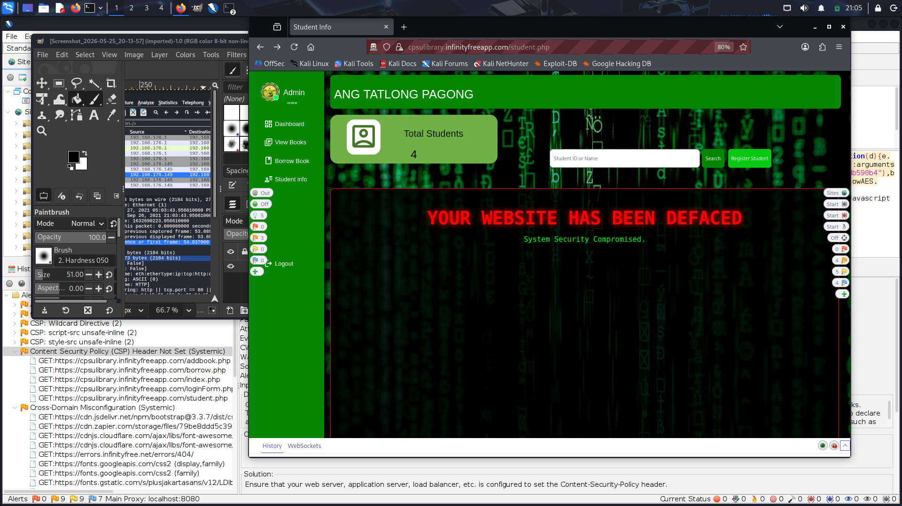
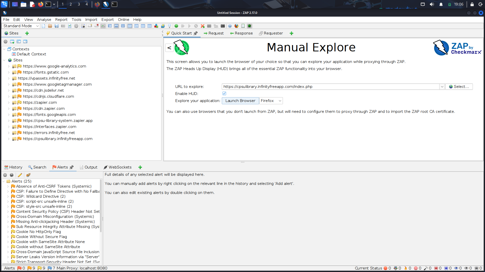
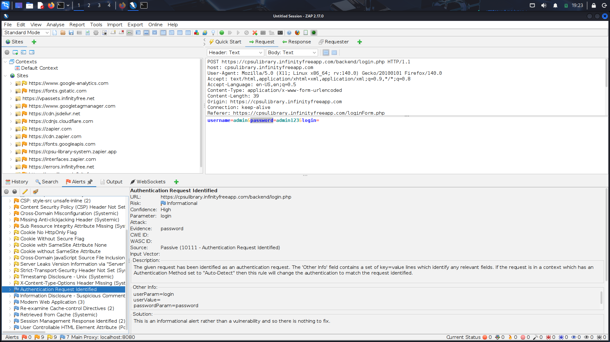

# 🛡️ Web Application Interface Manipulation & Vulnerability Assessment

## 📌 Overview
This project demonstrates a Client-Side DOM Manipulation Simulation and an automated security vulnerability audit on a web application inside a Kali Linux testing environment using OWASP ZAP. 

> Disclaimer: The interface modifications shown here are client-side simulations performed via browser Developer Tools for demonstration, testing, and educational purposes. No actual server-side files were permanently altered.

---

## 📸 Simulation & Security Analysis

### 1. Client-Side DOM & UI Manipulation Simulation
Demonstration of temporary client-side layout and style overrides executed via DevTools to simulate interface response testing.

### 2. OWASP ZAP Vulnerability Scanning Results
Automated security assessment highlighting missing security headers and configuration risks.

### 3. Intercepted Authentication Request
Inspection of HTTP POST requests and parameter handling captured using OWASP ZAP proxy.

---

## 🛠️ Simulation Steps (DevTools Layout Overrides)

1. Access Developer Console: Press F12 or Ctrl + Shift + I in Firefox/Chrome.

2. Apply Custom Theme:
   Modify the body element style attribute with background-image: url('MATRIX_IMAGE_URL'); background-size: cover; background-attachment: fixed;

3. Inject Custom Alert Banner:
   Locate the content node (.table-holder) and replace its HTML content with:
   <section class="table-holder" style="background: rgba(0,0,0,0.85); border: 2px solid #ff0000; padding: 50px; text-align: center;"><h1 style="color: #ff0000; font-size: 3rem; text-shadow: 0 0 15px #ff0000;">YOUR WEBSITE HAS BEEN DEFACED</h1>
System Security Compromised.
</section>

---

## 🔍 OWASP ZAP Security Audit Findings

During the passive and active scanning phases, several web security issues were identified:

| Vulnerability / Alert | Risk Level | Description |
| :--- | :---: | :--- |
| Absence of Anti-CSRF Tokens | Medium | Forms lack unique tokens, making them susceptible to Cross-Site Request Forgery. |
| Missing Anti-clickjacking Header | Medium | Missing X-Frame-Options or CSP frame-ancestors directive. |
| Content Security Policy (CSP) Header Not Set | Medium | Absence of CSP header leaves the application prone to client-side injection attacks. |
| Cookie No HttpOnly / Secure Flag | Low | Session cookies can be accessed via client-side scripts. |

---

## 💡 Recommended Security Hardening

1. Implement Anti-CSRF Tokens: Ensure all POST forms generate and validate unique session tokens.
2. Configure Security Headers: Add X-Frame-Options: DENY or SAMEORIGIN, and implement a strict Content-Security-Policy (CSP).
3. Protect Session Cookies: Enforce HttpOnly and Secure flags on sensitive cookies.
